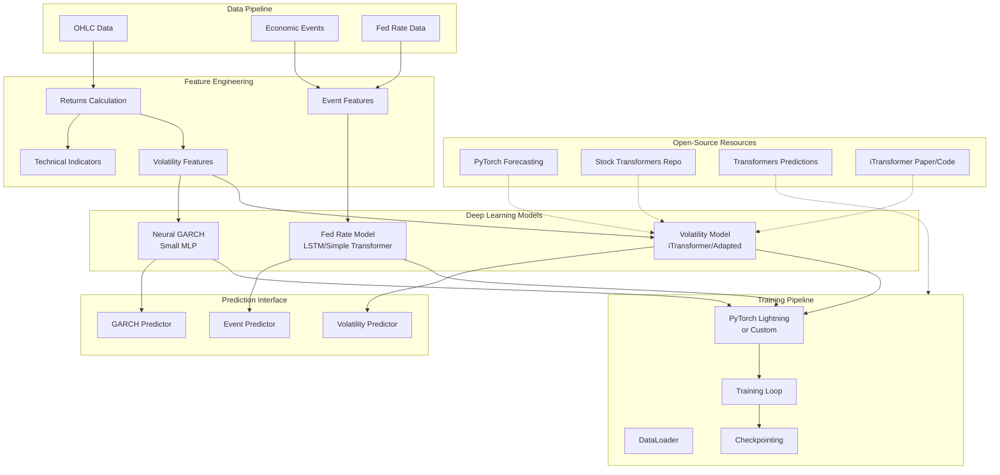

# Deep Learning Volatility Prediction Implementation Plan

## (Leveraging Open-Source Resources)

## Overview

This plan extends the existing volatility estimator stack with deep learning capabilities using PyTorch and NVIDIA CUDA GPUs. **Instead of building from scratch, we'll leverage and adapt existing open-source transformer architectures and libraries** to accelerate development.

The implementation will add three new prediction modules:

1. **Forward Realized Volatility Prediction** - Using iTransformer or adapted stock transformers architecture
2. **Fed Rate Event Prediction** - LSTM or simple transformer for Fed rate change prediction
3. **GARCH Conditional Variance** - Small MLP-based neural GARCH model

## Open-Source Resources to Leverage

### Primary Resources

1. **PyTorch Forecasting Library** (`pytorch-forecasting`)

   - Complete framework with Temporal Fusion Transformer
   - Built-in data loaders and training infrastructure
   - **Decision Point**: Use library directly OR extract architectures

2. **Stock Transformers Repository** (`github.com/Ghruank/stocktransformers`)

   - Complete PyTorch implementation
   - LSTM, Transformer, Informer models
   - Time2Vec encoding
   - **Action**: Clone, examine, adapt for volatility prediction

3. **Transformers Predictions Dashboard** (`github.com/jedarden/transformers-predictions`)

   - Full-stack implementation with Streamlit
   - Transformer models for financial prediction
   - **Action**: Reference for UI integration and model structure

4. **iTransformer Architecture** (from research paper)

   - Inverted transformer design (better for time series)
   - Simpler than standard transformers
   - **Action**: Implement based on paper or find GitHub implementation

### Secondary Resources

5. **PyTorch Lightning** - Training infrastructure wrapper
6. **HuggingFace Transformers** - Reference architectures if needed

## Architecture (Updated)



## Implementation Strategy

### Phase 1: Research & Setup (Days 1-2)

1. **Clone and examine repositories**:
   ```bash
   git clone https://github.com/Ghruank/stocktransformers.git
   git clone https://github.com/jedarden/transformers-predictions.git
   ```

2. **Install and test PyTorch Forecasting**:
   ```bash
   pip install pytorch-forecasting
   # Test Temporal Fusion Transformer on sample data
   ```

3. **Search for iTransformer implementation**:

   - Check GitHub for "iTransformer pytorch"
   - If not found, implement from paper (simpler than full transformer)

4. **Set up GPU utilities** (`src/models/utils.py`)

### Phase 2: Model Adaptation (Days 3-6)

#### 2.1 Forward Volatility Prediction

**Option A: Use PyTorch Forecasting**

- Use Temporal Fusion Transformer (TFT) directly
- Adapt data format to our OHLC structure
- **Pros**: Fastest, proven framework
- **Cons**: Less customization

**Option B: Adapt Stock Transformers**

- Extract transformer architecture
- Modify for volatility prediction (not price)
- Use their Time2Vec encoding
- **Pros**: More control, learn structure
- **Cons**: More work

**Option C: Implement iTransformer**

- Based on paper: arXiv:2310.06625
- Inverted design (variables as tokens)
- **Pros**: State-of-the-art for time series
- **Cons**: Need to implement from paper

**Recommendation**: Start with Option B (adapt stock transformers), fallback to Option A if needed

**Location**: `src/models/volatility_predictor.py`

#### 2.2 Fed Rate Event Prediction

**Approach**: Simple LSTM or feed-forward network

- Less complex than volatility prediction
- Can build from scratch or use PyTorch Lightning templates
- **Location**: `src/models/fed_rate_predictor.py`

#### 2.3 Neural GARCH

**Approach**: Small MLP (2-3 layers, 16-32 units)

- Simple enough to implement quickly
- No good open-source implementations found
- **Location**: `src/models/neural_garch.py`

### Phase 3: Training Infrastructure (Days 7-8)

**Option A: Use PyTorch Lightning**

- Simplifies training loops
- Built-in GPU management
- Checkpointing and logging
- **Install**: `pip install pytorch-lightning`

**Option B: Adapt from Stock Transformers**

- Use their training loop structure
- Adapt for our use case

**Recommendation**: Use PyTorch Lightning for faster development

**Location**: `src/training/`

### Phase 4: Integration (Days 9-10)

1. Integrate models with existing `BaseEstimator` interface
2. Update `src/predictions.py` with DL prediction functions
3. Add Streamlit UI sections (reference transformers-predictions dashboard)
4. Update configuration files

## Implementation Details

### 1. Forward Realized Volatility Prediction

**Location**: `src/models/volatility_predictor.py`

**Architecture Options**:

- **iTransformer** (preferred): Inverted transformer, better for time series
- **Adapted Stock Transformers**: Their transformer with modifications
- **Temporal Fusion Transformer**: From pytorch-forecasting library

**Input Features**:

- Historical returns (log returns, squared returns)
- Current volatility estimates (from existing estimators)
- Technical indicators (RSI, MACD, Bollinger Bands)
- Market regime indicators

**Output**: Predicted realized volatility for configurable horizons (1, 5, 10, 20 days)

**Training**: Supervised learning on historical realized volatility

**Loss Function**: MSE with Huber loss for robustness

### 2. Fed Rate Event Prediction

**Location**: `src/models/fed_rate_predictor.py`

**Architecture**: Simple LSTM (1-2 layers, 32-64 units) or feed-forward network

**Input Features**:

- Historical Fed rates (from yfinance `^IRX` or similar)
- Volatility regime
- Time-to-event features
- Economic indicators (if available)

**Output**:

- Classification: Increase/Decrease/No Change
- Regression: Magnitude of change in bps

**Training**: Multi-task learning (classification + regression)

### 3. GARCH Conditional Variance

**Location**: `src/models/neural_garch.py`

**Architecture**: Small MLP (2-3 layers, 16-32 units each)

**Input Features**: Historical returns, volatility shocks

**Output**: Conditional variance estimates

**Training**: Maximum likelihood estimation with neural parameterization

**Integration**: Extends `BaseEstimator` to work with existing framework

### 4. GPU/CUDA Support

**Location**: `src/models/utils.py`

- Automatic GPU detection and device selection
- CPU fallback if CUDA unavailable
- Batch processing for efficient GPU utilization
- Mixed precision training (FP16) for faster training

### 5. Training Infrastructure

**Location**: `src/training/`

**Using PyTorch Lightning**:

- `trainer.py`: Lightning Trainer with callbacks
- `data_module.py`: Lightning DataModule for data loading
- `metrics.py`: Evaluation metrics (MAE, RMSE, MAPE)
- `callbacks.py`: Early stopping, checkpointing, learning rate scheduling

**Or Custom** (if adapting from repos):

- `trainer.py`: Main training loop
- `data_loader.py`: PyTorch DataLoader
- `metrics.py`: Evaluation metrics
- `config.py`: Training hyperparameters

### 6. Feature Engineering

**Location**: `src/features/`

- `feature_extractor.py`: Extract features from OHLC data
- `technical_indicators.py`: Calculate technical indicators (use `pandas-ta` or `ta-lib`)
- `fed_data_loader.py`: Fetch and process Fed rate data from yfinance

## File Structure

```
src/
├── models/
│   ├── __init__.py
│   ├── volatility_predictor.py      # iTransformer or adapted transformer
│   ├── fed_rate_predictor.py          # LSTM or simple transformer
│   ├── neural_garch.py                 # Small MLP for GARCH
│   └── utils.py                        # GPU utilities, device management
├── training/
│   ├── __init__.py
│   ├── trainer.py                      # PyTorch Lightning or custom
│   ├── data_module.py                  # Lightning DataModule (if using Lightning)
│   ├── metrics.py                      # Evaluation metrics
│   └── callbacks.py                    # Lightning callbacks
├── features/
│   ├── __init__.py
│   ├── feature_extractor.py            # Main feature extraction
│   ├── technical_indicators.py         # Technical indicators
│   └── fed_data_loader.py              # Fed rate data loading
├── estimators/
│   └── neural_garch.py                 # Neural GARCH estimator (extends BaseEstimator)
└── predictions.py                      # Updated with DL predictions

models/
└── checkpoints/                        # Saved model checkpoints

# Reference repositories (cloned locally for study)
external/
├── stocktransformers/                  # Cloned repo
└── transformers-predictions/         # Cloned repo
```

## Configuration Updates

Add to `config.yaml`:

```yaml
deep_learning:
  device: auto  # auto, cuda, cpu
  batch_size: 64
  num_workers: 4
  mixed_precision: true
  use_lightning: true  # Use PyTorch Lightning for training
  
volatility_predictor:
  model_type: itransformer  # itransformer, transformer, tft
  d_model: 128
  nhead: 8
  num_layers: 4
  dropout: 0.1
  prediction_horizons: [1, 5, 10, 20]  # days
  
fed_rate_predictor:
  model_type: lstm  # lstm or transformer
  hidden_dim: 64
  num_layers: 2
  
neural_garch:
  p: 1  # GARCH(p,q)
  q: 1
  hidden_layers: [32, 16]
  
training:
  learning_rate: 0.001
  epochs: 100
  early_stopping_patience: 10
  train_test_split: 0.8
  validation_split: 0.1
```

## Dependencies

Add to `requirements.txt`:

```python
# Core PyTorch
torch>=2.0.0
torchvision>=0.15.0

# Training Infrastructure
pytorch-lightning>=2.0.0  # Recommended for faster development

# Optional: PyTorch Forecasting (if using TFT)
# pytorch-forecasting>=1.0.0

# Feature Engineering
scikit-learn>=1.3.0  # For feature scaling
pandas-ta>=0.3.14b0  # Technical indicators (or ta-lib)

# Utilities
numpy>=1.24.0  # Already in requirements
pandas>=2.0.0  # Already in requirements
```

## Testing Strategy

- Unit tests for each model architecture
- Integration tests for training pipeline
- GPU availability tests
- Model inference tests
- Backtesting framework for predictions
- Compare adapted models vs original implementations

## Implementation Order (Updated)

1. **Research Phase**: Clone and examine open-source repos (1-2 days)
2. **Setup**: GPU utilities, feature engineering (1 day)
3. **Evaluate Options**: Test pytorch-forecasting, decide on approach (1 day)
4. **Build Models**: Adapt/implement volatility, Fed rate, GARCH models (3-4 days)
5. **Training**: Set up PyTorch Lightning or custom training (1-2 days)
6. **Integration**: Connect with existing codebase (1-2 days)
7. **UI & Testing**: Streamlit integration and testing (1-2 days)
8. **Documentation**: Update docs with credits to open-source projects

## Time Savings from Open-Source

| Component | From Scratch | Using Open-Source | Savings |

|-----------|--------------|-------------------|---------|

| Transformer Architecture | 3-4 days | 1-2 days (adapt) | 2 days |

| Training Infrastructure | 2-3 days | 0.5-1 day (Lightning) | 1.5-2 days |

| Data Loading | 1-2 days | 0.5 day (adapt) | 0.5-1.5 days |

| **Total** | **6-9 days** | **2-3.5 days** | **4-5.5 days** |

## Credits & Attribution

When implementing, ensure proper attribution to:

- Stock Transformers repository (if code is adapted)
- Transformers Predictions dashboard (for UI reference)
- iTransformer paper authors (if implemented)
- PyTorch Forecasting library (if used)
- PyTorch Lightning (if used)

## Next Steps

1. Clone the recommended repositories
2. Install and test PyTorch Forecasting
3. Search GitHub for iTransformer implementation
4. Begin Phase 1 implementation